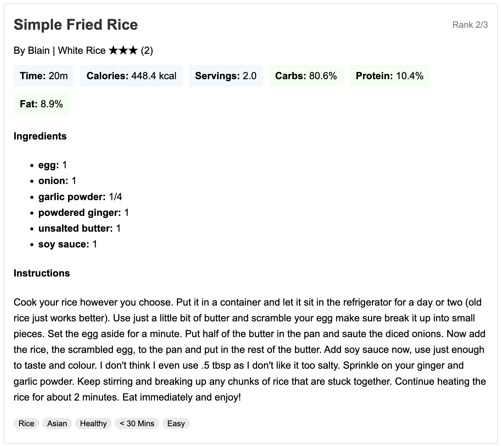

# 🧠 CraveControl Agent - Recipe Showcase Examples

This file contains three sample interactions with the CraveControl agent.  
Each section includes the **user input** and the **top 3 recipe suggestions** displayed by the system.

---

## 🍽️ Example 1

**User Input:**  

*"I'm daniel 33 years old, weight 50 kg, and I'm 170cm tall.I'm female and I work out 6 times a week.I want a heavy dinner with bagel with bacon, egg and cheese.I have ham and bagel and tomato in my fridge"*

**Suggested Recipes:**

1. 
2. 
3. 

### FeedBack:
**Would you like to give feedback on the recipe?**  
`(yes/no):` **yes**

**Feedback Time!**  
**Any ingredients you'd like to ADD?**  
`cucamber`

**Any ingredients you'd like to REMOVE?**  
`egg`

**Suggested Recipes:**

1. 
2. 
3. 

---

## 🍽️ Example 2

**User Input:**  

*"Hey! im 15 years old, weight 63 kg, and I'm 163. I'm a male and I work out 3 times a week. I want to have a breakfastwith pancakes. I have fruits at home."*

**Suggested Recipes:**

1. 
2. 
3. 

### FeedBack:
**Would you like to give feedback on the recipe?**  
`(yes/no):` **yes**

**Feedback Time!**  
**Any ingredients you'd like to ADD?**  
`chocolate`

**Any ingredients you'd like to REMOVE?**  
`bannana`

**Suggested Recipes:**

1. 
2. 
3. 

---

## 🍽️ Example 3

**User Input:**  
*"whats app crave control!! im so hungry, i want chicken for lunch, i wheight 78kg and im 180cm. im 27, and i have paprika. i love working out 6 times a week, and i love cheese."*

**Suggested Recipes:**

1. 
2. 
3. 

### FeedBack:
**Would you like to give feedback on the recipe?**  
`(yes/no):` **yes**

**Feedback Time!**  
**Any ingredients you'd like to ADD?**  
`rice`

**Any ingredients you'd like to REMOVE?**  
`potatos`

**Suggested Recipes:**

1. 
2. 
3. 
---
